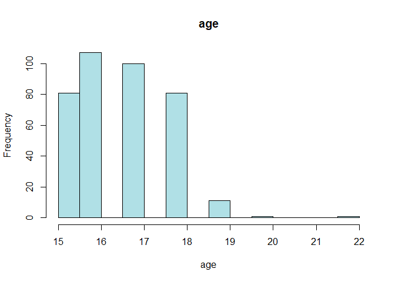

Student\_Perfomance
================
Purity
29/05/2020

**Given below are attributes**

*Attributes for both student-mat.csv (Math course) and student-por.csv
(Portuguese language course) datasets:*

1 school - student’s school (binary: ‘GP’ - Gabriel Pereira or ‘MS’ -
Mousinho da Silveira)

2 sex - student’s sex (binary: ‘F’ - female or ‘M’ - male)

3.age - student’s age (numeric: from 15 to 22)

4.address - student’s home address type (binary: ‘U’ - urban or ‘R’ -
rural)

5.famsize - family size (binary: ‘LE3’ - less or equal to 3 or ‘GT3’ -
greater than 3)

6.Pstatus - parent’s cohabitation status (binary: ‘T’ - living together
or ‘A’ - apart)

7.Medu - mother’s education (numeric: 0 - none, 1 - primary education
(4th grade), 2 – 5th to 9th grade, 3 – secondary education or 4 – higher
education)

8.Fedu - father’s education (numeric: 0 - none, 1 - primary education
(4th grade), 2 – 5th to 9th grade, 3 – secondary education or 4 – higher
education)

9.Mjob - mother’s job (nominal: ‘teacher’, ‘health’ care related, civil
‘services’ (e.g. administrative or police), ‘at\_home’ or ‘other’)

10.Fjob - father’s job (nominal: ‘teacher’, ‘health’ care related, civil
‘services’ (e.g. administrative or police), ‘at\_home’ or ‘other’)

11.reason - reason to choose this school (nominal: close to ‘home’,
school ‘reputation’, ‘course’ preference or ‘other’)

12.guardian - student’s guardian (nominal: ‘mother’, ‘father’ or
‘other’)

13.traveltime - home to school travel time (numeric: 1 - 1 hour)

14.studytime - weekly study time (numeric: 1 - 10 hours)

15.failures - number of past class failures (numeric: n if 1\<=n\<3,
else 4)

16.schoolsup - extra educational support (binary: yes or no)

17.famsup - family educational support (binary: yes or no)

18.paid - extra paid classes within the course subject (Math or
Portuguese) (binary: yes or no)

19.activities - extra-curricular activities (binary: yes or no)

20.nursery - attended nursery school (binary: yes or no)

21.higher - wants to take higher education (binary: yes or no)

22.internet - Internet access at home (binary: yes or no)

23.romantic - with a romantic relationship (binary: yes or no)

24.famrel - quality of family relationships (numeric: from 1 - very bad
to 5 - excellent)

25.freetime - free time after school (numeric: from 1 - very low to 5 -
very high)

26.goout - going out with friends (numeric: from 1 - very low to 5 -
very high)

27.Dalc - workday alcohol consumption (numeric: from 1 - very low to 5 -
very high)

28.Walc - weekend alcohol consumption (numeric: from 1 - very low to 5 -
very high)

29.health - current health status (numeric: from 1 - very bad to 5 -
very good)

30.absences - number of school absences (numeric: from 0 to 93) These
grades are related with the course subject, Math or Portuguese: 1.G1 -
first period grade (numeric: from 0 to 20)

2.G2 - second period grade (numeric: from 0 to 20)

3.G3 - final grade (numeric: from 0 to 20, output target)

Additional note: there are several (382) students that belong to both
datasets .

These students can be identified by searching for identical attributes

that characterize each student, as shown in the annexed R file. Source
Information

P. Cortez and A. Silva. Using Data Mining to Predict Secondary School
Student Performance. In A. Brito and J. Teixeira Eds., Proceedings of
5th FUture BUsiness TEChnology Conference (FUBUTEC 2008) pp. 5-12,
Porto, Portugal, April, 2008, EUROSIS, ISBN 978-9077381-39-7. Fabio
Pagnotta, Hossain Mohammad Amran.
Email:<fabio.pagnotta@studenti.unicam.it>, mohammadamra.hossain ‘@’
studenti.unicam.it University Of Camerino

<https://archive.ics.uci.edu/ml/datasets/STUDENT+ALCOHOL+CONSUMPTION>

# ***Business Understanding***

A Non Governmental Organization has collected data from students doing
math and portugese course in high school.They would like to gain
insights from the social,gender and study information about them. They
would also like you to predict the student final results.

  - Solution

Do EDA and get as many insights as possible.Use the suitable supervised
machine learning algorithm to predict what is needed.

# ***Data Understanding***

Here we load the datasets needed.Know about it all by checking
distributions/skewness,shape and skewness.

``` r
#load the data sets and libraries
library(tidyverse)##Is a set of packages that include dplyr,tidyr etc
```

    ## Warning: package 'tidyverse' was built under R version 3.6.3

    ## -- Attaching packages ------------------------ tidyverse 1.3.0 --

    ## v ggplot2 3.2.1     v purrr   0.3.4
    ## v tibble  2.1.3     v dplyr   0.8.3
    ## v tidyr   1.0.0     v stringr 1.4.0
    ## v readr   1.3.1     v forcats 0.4.0

    ## Warning: package 'readr' was built under R version 3.6.3

    ## Warning: package 'purrr' was built under R version 3.6.3

    ## -- Conflicts --------------------------- tidyverse_conflicts() --
    ## x dplyr::filter() masks stats::filter()
    ## x dplyr::lag()    masks stats::lag()

``` r
d1=read.csv("student-mat.csv",header=TRUE)
d2=read.csv("student-por.csv",header=TRUE)
head(d2)
```

    ##   school sex age address famsize Pstatus Medu Fedu     Mjob     Fjob
    ## 1     GP   F  18       U     GT3       A    4    4  at_home  teacher
    ## 2     GP   F  17       U     GT3       T    1    1  at_home    other
    ## 3     GP   F  15       U     LE3       T    1    1  at_home    other
    ## 4     GP   F  15       U     GT3       T    4    2   health services
    ## 5     GP   F  16       U     GT3       T    3    3    other    other
    ## 6     GP   M  16       U     LE3       T    4    3 services    other
    ##       reason guardian traveltime studytime failures schoolsup famsup paid
    ## 1     course   mother          2         2        0       yes     no   no
    ## 2     course   father          1         2        0        no    yes   no
    ## 3      other   mother          1         2        0       yes     no   no
    ## 4       home   mother          1         3        0        no    yes   no
    ## 5       home   father          1         2        0        no    yes   no
    ## 6 reputation   mother          1         2        0        no    yes   no
    ##   activities nursery higher internet romantic famrel freetime goout Dalc
    ## 1         no     yes    yes       no       no      4        3     4    1
    ## 2         no      no    yes      yes       no      5        3     3    1
    ## 3         no     yes    yes      yes       no      4        3     2    2
    ## 4        yes     yes    yes      yes      yes      3        2     2    1
    ## 5         no     yes    yes       no       no      4        3     2    1
    ## 6        yes     yes    yes      yes       no      5        4     2    1
    ##   Walc health absences G1 G2 G3
    ## 1    1      3        4  0 11 11
    ## 2    1      3        2  9 11 11
    ## 3    3      3        6 12 13 12
    ## 4    1      5        0 14 14 14
    ## 5    2      5        0 11 13 13
    ## 6    2      5        6 12 12 13

``` r
d4=merge(d1,d2,by=c("school","sex","age","address","famsize","Pstatus","Medu","Fedu","Mjob","Fjob","reason","nursery","internet"))
#d4[!duplicated(d4$guardian.x,d4)]
print(nrow(d4))
```

    ## [1] 382

AS seen above the two are merged to give a common dataset with 382 rows

``` r
d3<-read.csv("d3.csv")
view(d3)
```

## *Check The Shape*

``` r
dim(d3)
```

    ## [1] 382  35

``` r
anyDuplicated(colnames(d3))
```

    ## [1] 0

## *Check the structure*

``` r
#I normally use glimpse 
glimpse(d3)
```

    ## Observations: 382
    ## Variables: 35
    ## $ school       <fct> GP, GP, GP, GP, GP, GP, GP, GP, GP, GP, GP, GP, G...
    ## $ sex          <fct> F, F, F, F, F, F, F, F, F, F, F, F, F, F, F, F, F...
    ## $ age          <int> 15, 15, 15, 15, 15, 15, 15, 15, 15, 15, 15, 15, 1...
    ## $ address      <fct> R, R, R, R, R, R, R, R, R, U, U, U, U, U, U, U, U...
    ## $ famsize      <fct> GT3, GT3, GT3, GT3, GT3, GT3, GT3, LE3, LE3, GT3,...
    ## $ Pstatus      <fct> T, T, T, T, T, T, T, T, T, A, A, T, T, T, T, T, T...
    ## $ Medu         <int> 1, 1, 2, 2, 3, 3, 3, 2, 3, 3, 4, 1, 1, 1, 1, 1, 2...
    ## $ Fedu         <int> 1, 1, 2, 4, 3, 4, 4, 2, 1, 3, 3, 1, 1, 1, 2, 2, 1...
    ## $ Mjob         <fct> at_home, other, at_home, services, services, serv...
    ## $ Fjob         <fct> other, other, other, health, services, health, te...
    ## $ reason       <fct> home, reputation, reputation, course, reputation,...
    ## $ nursery      <fct> yes, no, yes, yes, yes, yes, yes, yes, no, yes, y...
    ## $ internet     <fct> yes, yes, no, yes, yes, yes, yes, yes, yes, no, y...
    ## $ traveltime.x <int> 2, 1, 1, 1, 2, 1, 2, 2, 2, 1, 1, 3, 1, 1, 1, 1, 3...
    ## $ studytime.x  <int> 4, 2, 1, 3, 3, 3, 3, 2, 4, 4, 2, 1, 2, 2, 2, 2, 3...
    ## $ failures.x   <int> 1, 2, 0, 0, 2, 0, 2, 0, 0, 0, 0, 0, 0, 0, 0, 0, 0...
    ## $ schoolsup.x  <fct> yes, yes, yes, yes, no, yes, no, yes, no, yes, no...
    ## $ famsup.x     <fct> yes, yes, yes, yes, yes, yes, yes, yes, yes, no, ...
    ## $ paid.x       <fct> yes, no, yes, yes, yes, yes, no, yes, no, no, yes...
    ## $ activities.x <fct> yes, no, yes, yes, yes, yes, no, no, no, no, yes,...
    ## $ higher.x     <fct> yes, yes, yes, yes, yes, yes, yes, yes, yes, yes,...
    ## $ romantic.x   <fct> no, yes, no, no, yes, no, yes, no, no, no, no, ye...
    ## $ famrel.x     <int> 3, 3, 4, 4, 4, 4, 4, 4, 4, 4, 4, 4, 4, 4, 4, 3, 5...
    ## $ freetime.x   <int> 1, 3, 3, 3, 2, 3, 2, 1, 4, 3, 3, 3, 3, 4, 3, 2, 2...
    ## $ goout.x      <int> 2, 4, 1, 2, 1, 2, 2, 3, 2, 3, 2, 3, 2, 2, 2, 3, 2...
    ## $ Dalc.x       <int> 1, 2, 1, 1, 2, 1, 2, 1, 2, 1, 1, 1, 2, 1, 1, 1, 1...
    ## $ Walc.x       <int> 1, 4, 1, 1, 3, 1, 2, 3, 3, 1, 1, 2, 3, 2, 1, 2, 1...
    ## $ health.x     <int> 1, 5, 2, 5, 3, 5, 5, 4, 3, 4, 1, 4, 4, 5, 5, 1, 4...
    ## $ absences.x   <int> 2, 2, 8, 2, 8, 2, 0, 2, 12, 10, 0, 0, 2, 0, 2, 2,...
    ## $ G1.x         <int> 7, 8, 14, 10, 10, 12, 12, 8, 16, 10, 14, 8, 9, 8,...
    ## $ G2.x         <int> 10, 6, 13, 9, 10, 12, 0, 9, 16, 11, 15, 0, 10, 11...
    ## $ G3.x         <int> 10, 5, 13, 8, 10, 11, 0, 8, 16, 11, 15, 0, 10, 11...
    ## $ G1.y         <int> 13, 13, 14, 10, 13, 11, 10, 11, 15, 10, 15, 11, 1...
    ## $ G2.y         <int> 13, 11, 13, 11, 13, 12, 11, 10, 15, 10, 14, 12, 1...
    ## $ G3.y         <int> 13, 11, 12, 10, 13, 12, 12, 11, 15, 10, 15, 13, 1...

## *next check for missing values*

``` r
#Check per each column
colSums(is.na(d3))
```

    ##       school          sex          age      address      famsize 
    ##            0            0            0            0            0 
    ##      Pstatus         Medu         Fedu         Mjob         Fjob 
    ##            0            0            0            0            0 
    ##       reason      nursery     internet traveltime.x  studytime.x 
    ##            0            0            0            0            0 
    ##   failures.x  schoolsup.x     famsup.x       paid.x activities.x 
    ##            0            0            0            0            0 
    ##     higher.x   romantic.x     famrel.x   freetime.x      goout.x 
    ##            0            0            0            0            0 
    ##       Dalc.x       Walc.x     health.x   absences.x         G1.x 
    ##            0            0            0            0            0 
    ##         G2.x         G3.x         G1.y         G2.y         G3.y 
    ##            0            0            0            0            0

## *Have a summary of all*

``` r
summary(d3)
```

    ##  school   sex          age        address famsize   Pstatus
    ##  GP:342   F:198   Min.   :15.00   R: 81   GT3:278   A: 38  
    ##  MS: 40   M:184   1st Qu.:16.00   U:301   LE3:104   T:344  
    ##                   Median :17.00                            
    ##                   Mean   :16.59                            
    ##                   3rd Qu.:17.00                            
    ##                   Max.   :22.00                            
    ##       Medu            Fedu             Mjob           Fjob    
    ##  Min.   :0.000   Min.   :0.000   at_home : 53   at_home : 16  
    ##  1st Qu.:2.000   1st Qu.:2.000   health  : 33   health  : 17  
    ##  Median :3.000   Median :3.000   other   :138   other   :211  
    ##  Mean   :2.806   Mean   :2.565   services: 96   services:107  
    ##  3rd Qu.:4.000   3rd Qu.:4.000   teacher : 62   teacher : 31  
    ##  Max.   :4.000   Max.   :4.000                                
    ##         reason    nursery   internet   traveltime.x    studytime.x   
    ##  course    :140   no : 72   no : 58   Min.   :1.000   Min.   :1.000  
    ##  home      :110   yes:310   yes:324   1st Qu.:1.000   1st Qu.:1.000  
    ##  other     : 34                       Median :1.000   Median :2.000  
    ##  reputation: 98                       Mean   :1.442   Mean   :2.034  
    ##                                       3rd Qu.:2.000   3rd Qu.:2.000  
    ##                                       Max.   :4.000   Max.   :4.000  
    ##    failures.x     schoolsup.x famsup.x  paid.x    activities.x higher.x 
    ##  Min.   :0.0000   no :331     no :144   no :205   no :181      no : 18  
    ##  1st Qu.:0.0000   yes: 51     yes:238   yes:177   yes:201      yes:364  
    ##  Median :0.0000                                                         
    ##  Mean   :0.2906                                                         
    ##  3rd Qu.:0.0000                                                         
    ##  Max.   :3.0000                                                         
    ##  romantic.x    famrel.x      freetime.x       goout.x          Dalc.x     
    ##  no :261    Min.   :1.00   Min.   :1.000   Min.   :1.000   Min.   :1.000  
    ##  yes:121    1st Qu.:4.00   1st Qu.:3.000   1st Qu.:2.000   1st Qu.:1.000  
    ##             Median :4.00   Median :3.000   Median :3.000   Median :1.000  
    ##             Mean   :3.94   Mean   :3.223   Mean   :3.113   Mean   :1.474  
    ##             3rd Qu.:5.00   3rd Qu.:4.000   3rd Qu.:4.000   3rd Qu.:2.000  
    ##             Max.   :5.00   Max.   :5.000   Max.   :5.000   Max.   :5.000  
    ##      Walc.x        health.x       absences.x          G1.x      
    ##  Min.   :1.00   Min.   :1.000   Min.   : 0.000   Min.   : 3.00  
    ##  1st Qu.:1.00   1st Qu.:3.000   1st Qu.: 0.000   1st Qu.: 8.00  
    ##  Median :2.00   Median :4.000   Median : 3.000   Median :10.50  
    ##  Mean   :2.28   Mean   :3.579   Mean   : 5.319   Mean   :10.86  
    ##  3rd Qu.:3.00   3rd Qu.:5.000   3rd Qu.: 8.000   3rd Qu.:13.00  
    ##  Max.   :5.00   Max.   :5.000   Max.   :75.000   Max.   :19.00  
    ##       G2.x            G3.x            G1.y            G2.y      
    ##  Min.   : 0.00   Min.   : 0.00   Min.   : 0.00   Min.   : 5.00  
    ##  1st Qu.: 8.25   1st Qu.: 8.00   1st Qu.:10.00   1st Qu.:11.00  
    ##  Median :11.00   Median :11.00   Median :12.00   Median :12.00  
    ##  Mean   :10.71   Mean   :10.39   Mean   :12.11   Mean   :12.24  
    ##  3rd Qu.:13.00   3rd Qu.:14.00   3rd Qu.:14.00   3rd Qu.:14.00  
    ##  Max.   :19.00   Max.   :20.00   Max.   :19.00   Max.   :19.00  
    ##       G3.y      
    ##  Min.   : 0.00  
    ##  1st Qu.:11.00  
    ##  Median :13.00  
    ##  Mean   :12.52  
    ##  3rd Qu.:14.00  
    ##  Max.   :19.00

## *Remove Some things*

since this is a merge from portugese and math course for students who do
both they have final grade for the two So we have to have common final
grade I decided to add and divide by 2 to get the common final grade for
a student

``` r
d3<-d3%>%
  mutate(G1=(G1.x +G1.y)/2,
         G2 = ( G2.x  + G2.y  )/2,
         G3 = ( G3.x + G3.y  )/2)
```

know i will drop the grades from both.

``` r
dim(d3)
```

    ## [1] 382  38

``` r
d3<-select(d3,-c(30:35))
```

``` r
str(d3)
```

    ## 'data.frame':    382 obs. of  32 variables:
    ##  $ school      : Factor w/ 2 levels "GP","MS": 1 1 1 1 1 1 1 1 1 1 ...
    ##  $ sex         : Factor w/ 2 levels "F","M": 1 1 1 1 1 1 1 1 1 1 ...
    ##  $ age         : int  15 15 15 15 15 15 15 15 15 15 ...
    ##  $ address     : Factor w/ 2 levels "R","U": 1 1 1 1 1 1 1 1 1 2 ...
    ##  $ famsize     : Factor w/ 2 levels "GT3","LE3": 1 1 1 1 1 1 1 2 2 1 ...
    ##  $ Pstatus     : Factor w/ 2 levels "A","T": 2 2 2 2 2 2 2 2 2 1 ...
    ##  $ Medu        : int  1 1 2 2 3 3 3 2 3 3 ...
    ##  $ Fedu        : int  1 1 2 4 3 4 4 2 1 3 ...
    ##  $ Mjob        : Factor w/ 5 levels "at_home","health",..: 1 3 1 4 4 4 4 2 3 3 ...
    ##  $ Fjob        : Factor w/ 5 levels "at_home","health",..: 3 3 3 2 4 2 5 4 3 2 ...
    ##  $ reason      : Factor w/ 4 levels "course","home",..: 2 4 4 1 4 1 1 4 4 4 ...
    ##  $ nursery     : Factor w/ 2 levels "no","yes": 2 1 2 2 2 2 2 2 1 2 ...
    ##  $ internet    : Factor w/ 2 levels "no","yes": 2 2 1 2 2 2 2 2 2 1 ...
    ##  $ traveltime.x: int  2 1 1 1 2 1 2 2 2 1 ...
    ##  $ studytime.x : int  4 2 1 3 3 3 3 2 4 4 ...
    ##  $ failures.x  : int  1 2 0 0 2 0 2 0 0 0 ...
    ##  $ schoolsup.x : Factor w/ 2 levels "no","yes": 2 2 2 2 1 2 1 2 1 2 ...
    ##  $ famsup.x    : Factor w/ 2 levels "no","yes": 2 2 2 2 2 2 2 2 2 1 ...
    ##  $ paid.x      : Factor w/ 2 levels "no","yes": 2 1 2 2 2 2 1 2 1 1 ...
    ##  $ activities.x: Factor w/ 2 levels "no","yes": 2 1 2 2 2 2 1 1 1 1 ...
    ##  $ higher.x    : Factor w/ 2 levels "no","yes": 2 2 2 2 2 2 2 2 2 2 ...
    ##  $ romantic.x  : Factor w/ 2 levels "no","yes": 1 2 1 1 2 1 2 1 1 1 ...
    ##  $ famrel.x    : int  3 3 4 4 4 4 4 4 4 4 ...
    ##  $ freetime.x  : int  1 3 3 3 2 3 2 1 4 3 ...
    ##  $ goout.x     : int  2 4 1 2 1 2 2 3 2 3 ...
    ##  $ Dalc.x      : int  1 2 1 1 2 1 2 1 2 1 ...
    ##  $ Walc.x      : int  1 4 1 1 3 1 2 3 3 1 ...
    ##  $ health.x    : int  1 5 2 5 3 5 5 4 3 4 ...
    ##  $ absences.x  : int  2 2 8 2 8 2 0 2 12 10 ...
    ##  $ G1          : num  10 10.5 14 10 11.5 11.5 11 9.5 15.5 10 ...
    ##  $ G2          : num  11.5 8.5 13 10 11.5 12 5.5 9.5 15.5 10.5 ...
    ##  $ G3          : num  11.5 8 12.5 9 11.5 11.5 6 9.5 15.5 10.5 ...

``` r
d3[27:32]
```

    ##     Walc.x health.x absences.x   G1   G2   G3
    ## 1        1        1          2 10.0 11.5 11.5
    ## 2        4        5          2 10.5  8.5  8.0
    ## 3        1        2          8 14.0 13.0 12.5
    ## 4        1        5          2 10.0 10.0  9.0
    ## 5        3        3          8 11.5 11.5 11.5
    ## 6        1        5          2 11.5 12.0 11.5
    ## 7        2        5          0 11.0  5.5  6.0
    ## 8        3        4          2  9.5  9.5  9.5
    ## 9        3        3         12 15.5 15.5 15.5
    ## 10       1        4         10 10.0 10.5 10.5
    ## 11       1        1          0 14.5 14.5 15.0
    ## 12       2        4          0  9.5  6.0  6.5
    ## 13       3        4          2 11.0 11.0 11.0
    ## 14       2        5          0 10.0 11.5 11.5
    ## 15       1        5          2 11.5 11.5 12.0
    ## 16       2        1          2 15.0 14.5 14.5
    ## 17       1        4          4 10.0 12.0 12.5
    ## 18       1        3          8  8.5  9.0  9.0
    ## 19       1        5          0  9.5  9.0  8.5
    ## 20       1        3          0  8.5  9.0  5.5
    ## 21       1        2         26  9.0  8.0  8.0
    ## 22       1        5          2 14.5 14.0 14.5
    ## 23       3        1          4 14.0 14.5 14.5
    ## 24       3        1          4 15.0 15.0 15.5
    ## 25       1        5          0 12.0  7.0  7.5
    ## 26       3        5          0 10.5 11.0 11.5
    ## 27       3        5          6  9.5 10.0 10.0
    ## 28       1        3          2 10.0  9.5  9.5
    ## 29       2        2          0 12.0 11.0 11.5
    ## 30       1        5          2 11.0 12.0 12.0
    ## 31       1        5          0 14.5 15.0 14.5
    ## 32       4        1          6 11.5 12.5 13.0
    ## 33       1        1          0  8.5 10.5 11.0
    ## 34       1        5          8  9.0  9.5  8.5
    ## 35       3        3         10  9.5 10.5 11.0
    ## 36       1        5         10  9.5  8.5  8.5
    ## 37       1        5          2 13.5 13.5 14.5
    ## 38       4        2          0 11.5 11.0 11.0
    ## 39       1        5          6 11.5 11.5 12.0
    ## 40       1        2          0  9.0 10.5 10.5
    ## 41       3        4          6 13.5 13.5 13.5
    ## 42       1        2          8 10.0 11.0 11.0
    ## 43       1        4          0 12.5 13.0 13.5
    ## 44       2        4          5  9.0  9.0  9.5
    ## 45       1        5          0  6.5  4.5  5.0
    ## 46       4        5         16 13.5 12.0 12.5
    ## 47       4        5          6 10.5 11.0 11.5
    ## 48       5        5          6 10.0  9.0 13.5
    ## 49       1        3          0 11.0 10.0  6.5
    ## 50       1        5          2 10.5 10.5 11.0
    ## 51       1        5         20 11.0 11.0 11.0
    ## 52       1        5          6  9.0 11.5 11.5
    ## 53       1        4          0  9.0  9.5  6.5
    ## 54       1        5          0 10.0  9.0  9.5
    ## 55       3        3          0 12.0 12.0 12.0
    ## 56       4        5          2 13.0 12.5 12.5
    ## 57       3        5         14  8.0 10.0 10.0
    ## 58       3        4          6  9.5 11.0 11.0
    ## 59       1        2         10 11.5 12.0 13.0
    ## 60       1        3          2 14.5 14.5 15.5
    ## 61       2        5          4  8.5  8.0  8.0
    ## 62       2        1         14 13.0 14.0 14.0
    ## 63       2        5          4  8.5 11.5 11.5
    ## 64       3        4          0  8.0  9.0  9.5
    ## 65       1        4          4 10.5 12.0 12.0
    ## 66       4        5         54 11.0 11.5 11.0
    ## 67       2        3         12  8.5  8.0  8.0
    ## 68       1        3          0 15.5 16.0 17.0
    ## 69       1        5          2 15.5 15.5 16.0
    ## 70       1        1          0 12.0 12.0 12.0
    ## 71       5        2          2 15.0 15.0 15.5
    ## 72       1        3          0  9.5 11.0 10.5
    ## 73       4        4          2 12.0 11.0 11.0
    ## 74       1        1         10 12.5 13.5 14.0
    ## 75       1        3          0 15.0 15.0 15.5
    ## 76       2        2          4 15.5 15.5 15.5
    ## 77       2        1          6 11.5 13.5 13.5
    ## 78       2        2          6 13.0 13.5 14.0
    ## 79       1        5          0 14.0 14.5 15.0
    ## 80       4        3         12 12.0 12.0 12.0
    ## 81       3        1          2 12.0 12.5 12.0
    ## 82       1        1          4 10.5 11.5  9.5
    ## 83       2        2          4 10.5  9.0  8.5
    ## 84       2        5         14 10.0 10.5 10.0
    ## 85       2        3         25  9.0 10.5 10.5
    ## 86       3        4          2 13.0 13.0 13.0
    ## 87       2        5          2 13.5 12.5 13.0
    ## 88       3        2          4  9.5  9.5  9.0
    ## 89       1        4          4 12.0 12.5 12.0
    ## 90       2        1          2 16.0 15.0 15.5
    ## 91       1        4          4 14.5 15.0 15.0
    ## 92       2        3          0 10.0  9.5 10.5
    ## 93       3        2          4 11.5 12.0 13.0
    ## 94       1        3          2 13.0 12.0 12.0
    ## 95       2        5          2  8.5  8.0  8.5
    ## 96       2        3         18 10.0  9.5  9.5
    ## 97       1        5          7 13.5 14.5 14.5
    ## 98       5        5          0 13.0 13.0 13.5
    ## 99       1        4          6  9.0  9.5  9.5
    ## 100      2        3          3 11.0 11.0 10.5
    ## 101      1        3          6 18.0 18.5 18.5
    ## 102      2        3         12 10.0 10.5 10.5
    ## 103      2        3         10 13.5 12.5 14.0
    ## 104      2        4          0  9.5 10.0  7.0
    ## 105      3        3          6 10.0 10.0 11.5
    ## 106      2        5         23 14.0 13.5 15.0
    ## 107      1        1          6  8.0  9.0  9.5
    ## 108      1        3          4  7.0  8.0  8.5
    ## 109      1        5          0  9.0  8.5  6.0
    ## 110      1        3          0 10.0  9.5 10.5
    ## 111      3        1          4 11.5 12.0 12.5
    ## 112      1        3          6 13.0 12.5 13.0
    ## 113      1        4          4 10.5 11.0 11.5
    ## 114      2        5          4 11.0 10.5 12.5
    ## 115      1        3         12 12.5 11.0 11.0
    ## 116      4        3          3  9.5 10.0 10.5
    ## 117      1        1          2 12.5 13.0 13.0
    ## 118      3        5          0 16.5 17.5 17.0
    ## 119      3        5          1 14.5 16.0 16.0
    ## 120      2        5          0 17.5 17.5 18.0
    ## 121      3        3         10 16.5 16.5 16.0
    ## 122      3        2          0  9.5 10.5  7.5
    ## 123      1        4          4 12.5 10.5 11.0
    ## 124      4        5         28  9.0  9.0  8.5
    ## 125      3        5         16 13.5 14.0 14.5
    ## 126      1        3          0 15.5 14.0 15.0
    ## 127      3        4          0 12.0 13.5 14.0
    ## 128      2        3          0 16.0 16.5 16.5
    ## 129      4        1         22  8.5  7.5  7.0
    ## 130      1        4          0 12.0 12.0 12.5
    ## 131      3        2         24 16.0 16.5 17.0
    ## 132      3        4          7 10.5 10.0 10.5
    ## 133      3        4          7 11.5 10.5 11.0
    ## 134      2        4          4 14.5 14.0 14.5
    ## 135      3        2          0 15.0 14.5 15.0
    ## 136      3        5         12 11.5 12.5 12.0
    ## 137      3        5          6 12.0 12.0 12.0
    ## 138      1        2          0 10.0 10.0  6.0
    ## 139      1        5          0 14.0 15.0 15.5
    ## 140      3        1          2 14.0 15.5 15.0
    ## 141      3        1         56 11.5 11.0 11.0
    ## 142      1        4          6 14.0 13.5 15.0
    ## 143      2        3         14 13.5 12.5 13.0
    ## 144      1        5         75 11.0  9.0  9.5
    ## 145      5        4          6 10.0  9.0 10.5
    ## 146      2        3          0  7.0  4.5  5.0
    ## 147      1        4          0 12.0 11.0  7.0
    ## 148      1        4         16  8.5  8.0  7.5
    ## 149      2        4          8 11.0 10.5 11.5
    ## 150      1        3          1 14.5 14.5 15.0
    ## 151      1        3          6  2.5  8.5  8.5
    ## 152      1        4          4 10.0 11.0 11.5
    ## 153      1        4          4 11.0 11.5 12.0
    ## 154      1        3          0  9.5  5.0  5.5
    ## 155      2        1          0 10.0 10.0  7.5
    ## 156      2        2          5 18.0 18.0 18.5
    ## 157      1        3          0 10.0 11.0  6.5
    ## 158      2        3          4 11.0 11.0 12.0
    ## 159      3        2          4 15.5 15.0 15.0
    ## 160      3        1          7 13.5 14.5 15.5
    ## 161      1        4          0  8.5  5.5  6.0
    ## 162      1        5          9 11.5 12.5 13.0
    ## 163      1        3          0 15.0 15.0 15.5
    ## 164      3        2         21 16.0 16.5 16.5
    ## 165      1        4         15 11.5 10.0 10.5
    ## 166      3        5          2 11.5 11.0 12.0
    ## 167      1        4         14 13.0 12.5 13.0
    ## 168      1        3          2 12.0 12.0 12.0
    ## 169      1        2          0  9.0  8.5  6.0
    ## 170      1        1          7 15.0 14.5 16.0
    ## 171      2        2         10 11.5 11.0 11.0
    ## 172      1        5          2  8.0  9.0 10.0
    ## 173      2        3         10 10.0 10.0 10.0
    ## 174      3        5         15 10.0 10.5 10.5
    ## 175      3        2          0 12.0 11.0  6.5
    ## 176      1        5          8  9.5  9.0  9.5
    ## 177      1        1          2  9.0  8.0  8.0
    ## 178      1        5          0 10.5  5.5  5.5
    ## 179      1        5          0 15.0 15.0 15.5
    ## 180      5        1          6 11.0 11.5 12.0
    ## 181      1        3          0 14.0 15.0 15.5
    ## 182      1        1          0 16.0 17.0 17.0
    ## 183      5        3          4 12.0 12.5 12.0
    ## 184      2        5          2 11.5 12.0 11.5
    ## 185      1        1          0  8.5  9.0 10.5
    ## 186      2        5          6 15.0 13.5 14.0
    ## 187      2        5          4 10.5  9.5 10.0
    ## 188      3        3          2 10.5 11.5 12.0
    ## 189      1        5          0 13.0 13.5 14.0
    ## 190      2        4          6 14.0 13.0 13.5
    ## 191      2        5          0 11.0 11.0 10.5
    ## 192      1        1          8 11.5 11.0 10.5
    ## 193      4        1          4 13.0 13.5 13.0
    ## 194      1        3          0 10.5  9.5 10.0
    ## 195      2        5          2 13.0 13.5 13.5
    ## 196      2        3          2 11.0 11.0 12.0
    ## 197      3        5          6 10.0 10.0 10.5
    ## 198      1        1          0 12.5 13.5 14.5
    ## 199      1        3          0  8.0 10.0  5.5
    ## 200      1        5          0 11.5 13.5 13.5
    ## 201      4        5          0  9.5 11.0 11.5
    ## 202      1        2          2 13.5 14.0 15.0
    ## 203      1        5          4 11.0 13.0 13.0
    ## 204      1        5          0 16.0 15.5 16.0
    ## 205      1        5          2 16.5 16.5 16.5
    ## 206      1        5          4 14.5 15.0 15.5
    ## 207      5        5          0 10.0 10.0 10.5
    ## 208      1        1          0 15.5 17.0 18.0
    ## 209      4        5          6 10.5 10.0  9.5
    ## 210      1        4          6 15.5 16.5 16.5
    ## 211      1        5          2 11.5 11.5 11.5
    ## 212      1        4          6 11.0 12.5 13.0
    ## 213      3        4          4 14.0 13.5 14.0
    ## 214      1        2          0 10.5 11.0 12.0
    ## 215      1        3         10 18.0 18.0 18.5
    ## 216      1        4          2 14.5 15.0 16.0
    ## 217      3        5          2 13.0 13.5 13.0
    ## 218      4        5          8 11.0 11.5 11.5
    ## 219      1        5          7 14.0 14.5 14.0
    ## 220      3        3          0 11.0 11.0 10.0
    ## 221      2        3          2 14.5 12.5 13.0
    ## 222      4        5          8  9.5  9.5 10.0
    ## 223      4        3         10 10.0  8.5 10.0
    ## 224      1        4          2 10.0 13.0 13.0
    ## 225      5        4          8 16.0 16.0 16.5
    ## 226      5        3          8  9.5 10.0 11.0
    ## 227      4        5          0 12.0 13.5 13.0
    ## 228      1        3          2 14.5 16.0 17.0
    ## 229      2        3          2 10.5 10.5 11.0
    ## 230      1        4          6 16.5 17.0 17.0
    ## 231      4        4          4  9.5 10.0 10.5
    ## 232      1        3         12 11.5 10.0 10.5
    ## 233      1        3          0 13.0 13.0 13.0
    ## 234      2        5          2 12.5 12.5 14.0
    ## 235      1        5          0 13.0 13.0 13.0
    ## 236      3        2         10 11.5 10.5 11.0
    ## 237      1        5          0 12.0 13.0 13.5
    ## 238      3        2          6  8.0 10.5 10.0
    ## 239      4        5          4 10.0 11.0  6.5
    ## 240      1        5          0 13.5 14.0 14.0
    ## 241      1        5          2 14.5 16.0 16.0
    ## 242      1        5          2 13.5 15.0 15.5
    ## 243      2        3          2 12.5 13.5 13.0
    ## 244      2        3          2 11.5 12.5 12.5
    ## 245      4        2          0  7.5  7.0  5.0
    ## 246      1        2          4 18.0 18.0 18.5
    ## 247      3        3         10 10.0  9.0  9.5
    ## 248      4        5         18 13.0 12.0 13.0
    ## 249      4        1          2 13.5 13.0 13.5
    ## 250      2        5          0 13.5 13.5 13.5
    ## 251      2        5          0 14.0 12.5 12.5
    ## 252      5        4         14  8.0  8.0  6.5
    ## 253      1        4          0 16.0 16.5 16.5
    ## 254      1        5          0 11.5 10.0  7.0
    ## 255      1        5          0  8.0  7.5  4.0
    ## 256      2        5          2 15.5 14.5 15.0
    ## 257      2        5          2 12.0 12.0 12.0
    ## 258      5        5         16 11.0 11.5 11.5
    ## 259      1        5          4 11.5 11.5 12.0
    ## 260      5        5         18  8.5  7.5  8.5
    ## 261      1        5         18  9.0  8.0  7.5
    ## 262      3        5          0 12.0 11.0 11.0
    ## 263      5        5          6 10.5 11.5 12.0
    ## 264      2        5          0 14.0 14.5 15.5
    ## 265      1        3          0 12.5 12.0 12.0
    ## 266      4        5          0 11.5 11.5 11.0
    ## 267      2        2          8 10.5 10.0 10.0
    ## 268      3        5          2 13.5 14.0 15.0
    ## 269      3        5          4 10.0 11.0 11.0
    ## 270      2        5         10 13.5 13.5 14.0
    ## 271      1        3          0 10.0  7.0  7.5
    ## 272      2        1          2 15.5 15.5 16.0
    ## 273      5        3          4  8.5  9.0 10.0
    ## 274      4        5         20 10.5  9.0  9.5
    ## 275      4        5          0 10.0 12.0 12.5
    ## 276      1        1          4 11.5 12.0 12.0
    ## 277      5        4          8 11.0 10.0 10.0
    ## 278      4        5          0 10.0  4.5  5.0
    ## 279      3        4          2 11.0 11.5 12.0
    ## 280      5        5          0  6.5  8.0  7.5
    ## 281      3        5          8 12.5 10.0 11.5
    ## 282      2        5          0  7.5  7.0  4.5
    ## 283      2        4          2 12.0 11.0 11.5
    ## 284      5        5         12  8.5  9.5 10.0
    ## 285      2        5          0  7.0  4.5  5.0
    ## 286      2        5          0  7.0  3.5  3.0
    ## 287      1        3          2  8.5  8.5 10.0
    ## 288      1        3          2  8.5  7.5  8.0
    ## 289      1        2          4 10.5 12.0 13.0
    ## 290      4        5          2 10.0 10.0 12.0
    ## 291      4        5         16  7.0  6.5  6.0
    ## 292      3        5          4 14.0 13.5 13.0
    ## 293      4        4          4  8.5  7.0  8.0
    ## 294      5        5          3 15.5 16.5 16.5
    ## 295      3        4         12 11.5 12.5 12.5
    ## 296      1        2          4 10.5 10.5 12.0
    ## 297      2        5          4 15.0 14.0 15.0
    ## 298      3        2         14 12.0 11.0 11.0
    ## 299      4        3         19 12.0 11.0 11.5
    ## 300      4        5         30  9.5  9.5  9.0
    ## 301      2        5          2  8.0  9.5  9.0
    ## 302      5        4          4 15.0 14.5 14.5
    ## 303      3        3          2 11.0 11.0 11.5
    ## 304      4        5         14 13.5 13.5 13.5
    ## 305      4        4          4 10.0 10.0 10.0
    ## 306      2        5          0 11.5 12.0 11.5
    ## 307      5        3         13 12.5 12.0 12.5
    ## 308      3        5          0 12.0 10.0 10.0
    ## 309      1        3          1 11.5 11.5 12.0
    ## 310      2        4          9 15.5 14.5 16.5
    ## 311      4        1         13 16.0 16.5 16.5
    ## 312      1        4          8 14.0 14.0 14.5
    ## 313      3        5          8  6.5  7.0  7.5
    ## 314      2        4          8 15.5 15.0 15.0
    ## 315      5        5          4  6.5  8.5  7.0
    ## 316      3        2          6 14.5 14.5 14.5
    ## 317      5        4          0 11.0 11.0 11.5
    ## 318      5        2          0  7.5  7.0  4.0
    ## 319      4        5         15  9.0  9.0  9.5
    ## 320      4        5          0  6.5  8.0  7.5
    ## 321      3        5         10 10.0 10.5 12.0
    ## 322      4        5         11 13.5 13.5 13.5
    ## 323      1        3          2  9.0  9.0  9.5
    ## 324      3        5          0 12.0 11.5 11.5
    ## 325      2        3          3 11.0 13.0 12.0
    ## 326      4        3         22 10.5 10.5 11.0
    ## 327      4        3         22 10.0 10.5 10.5
    ## 328      2        2          0 11.0 11.0  6.5
    ## 329      2        2          0 10.5 11.0  6.0
    ## 330      1        2          9 16.0 15.0 16.0
    ## 331      5        4          0  8.5  7.0  0.0
    ## 332      5        3         14  9.5  9.0 10.0
    ## 333      4        5          2 10.0  9.5 10.0
    ## 334      4        4         13  8.0  8.0  9.0
    ## 335      3        5         11 16.0 15.5 16.0
    ## 336      2        1          8 10.0 10.5 10.0
    ## 337      2        1          5 17.0 16.5 16.5
    ## 338      2        5          0 12.5 11.0 11.5
    ## 339      1        4          0  8.0  4.5  5.5
    ## 340      1        1         12 11.0 12.0 12.5
    ## 341      1        5          0 15.5 16.5 16.5
    ## 342      5        1         16  6.5  8.0  6.5
    ## 343      2        1          0  7.5  7.0  4.5
    ## 344      3        1         14  6.5  6.5  7.0
    ## 345      2        3          0 12.5 12.0 12.5
    ## 346      3        1         17  9.0  9.5  9.5
    ## 347      2        5          4 12.0 12.5 12.5
    ## 348      1        3          8 11.5 11.0 11.5
    ## 349      2        5          2 13.5 13.0 13.0
    ## 350      1        1          0 15.5 14.5 15.0
    ## 351      2        4          2  9.0  9.5 11.0
    ## 352      3        4          2 12.0 13.0 12.5
    ## 353      2        5         10 10.5  8.5  5.5
    ## 354      2        5          7  6.5  7.0  8.0
    ## 355      1        1          0 17.0 17.5 18.0
    ## 356      4        2          4 10.5 11.5 12.0
    ## 357      1        5          0  6.5  6.5  3.5
    ## 358      1        5          0  8.5  8.5  4.5
    ## 359      2        4          0 10.5 10.0 10.0
    ## 360      2        1          0 15.5 15.5 15.5
    ## 361      1        5          0 10.0  9.5  9.5
    ## 362      3        3          0 12.0 11.5 11.5
    ## 363      1        4          0 18.5 16.5 17.0
    ## 364      1        1          0 11.0 12.0 12.0
    ## 365      2        5          0  8.5  8.0  5.0
    ## 366      3        2          4 11.5 11.0 11.0
    ## 367      1        3          2 12.5 13.0 13.0
    ## 368      3        3          2 10.5 11.0 11.5
    ## 369      4        2          3 12.0 13.0 13.0
    ## 370      4        3          4  9.0 10.0  9.5
    ## 371      3        5          5  7.0  6.5  3.5
    ## 372      5        5         10 10.0 11.5 12.0
    ## 373      3        3         14  6.5  6.0  2.5
    ## 374      3        3          3 11.5 11.0 11.0
    ## 375      4        5          0 10.5 11.5 10.5
    ## 376      4        2          4 16.0 16.0 16.5
    ## 377      2        3          4 12.0 11.5 12.0
    ## 378      3        3          7  8.5  8.5  8.5
    ## 379      2        5          0 14.0 14.5 14.5
    ## 380      3        5          4  8.0  8.5  9.0
    ## 381      3        2          8  9.0  8.0  9.5
    ## 382      3        5          0  5.5  6.5  0.0

## *now lets set text to be uniform*

``` r
colnames(d3)<-gsub(".x","",colnames(d3))
```

``` r
ncol(d3)
```

    ## [1] 32

``` r
colnames(d3)[2]<-"sex"
```

## *now check place them to same case*

``` r
colnames(d3)<-tolower(colnames(d3))
```

``` r
library(GGally)
```

    ## Warning: package 'GGally' was built under R version 3.6.3

    ## Registered S3 method overwritten by 'GGally':
    ##   method from   
    ##   +.gg   ggplot2

    ## 
    ## Attaching package: 'GGally'

    ## The following object is masked from 'package:dplyr':
    ## 
    ##     nasa

``` r
colnames(d3)
```

    ##  [1] "school"     "sex"        "age"        "address"    "famsize"   
    ##  [6] "pstatus"    "medu"       "fedu"       "mjob"       "fjob"      
    ## [11] "reason"     "nursery"    "internet"   "traveltime" "studytime" 
    ## [16] "failures"   "schoolsup"  "famsup"     "paid"       "activities"
    ## [21] "higher"     "romantic"   "famrel"     "freetime"   "goout"     
    ## [26] "dalc"       "walc"       "health"     "absences"   "g1"        
    ## [31] "g2"         "g3"

``` r
numeral<-d3%>%
  select_if(is.factor)
glimpse(numeral)
```

    ## Observations: 382
    ## Variables: 16
    ## $ school     <fct> GP, GP, GP, GP, GP, GP, GP, GP, GP, GP, GP, GP, GP,...
    ## $ sex        <fct> F, F, F, F, F, F, F, F, F, F, F, F, F, F, F, F, F, ...
    ## $ address    <fct> R, R, R, R, R, R, R, R, R, U, U, U, U, U, U, U, U, ...
    ## $ famsize    <fct> GT3, GT3, GT3, GT3, GT3, GT3, GT3, LE3, LE3, GT3, G...
    ## $ pstatus    <fct> T, T, T, T, T, T, T, T, T, A, A, T, T, T, T, T, T, ...
    ## $ mjob       <fct> at_home, other, at_home, services, services, servic...
    ## $ fjob       <fct> other, other, other, health, services, health, teac...
    ## $ reason     <fct> home, reputation, reputation, course, reputation, c...
    ## $ nursery    <fct> yes, no, yes, yes, yes, yes, yes, yes, no, yes, yes...
    ## $ internet   <fct> yes, yes, no, yes, yes, yes, yes, yes, yes, no, yes...
    ## $ schoolsup  <fct> yes, yes, yes, yes, no, yes, no, yes, no, yes, no, ...
    ## $ famsup     <fct> yes, yes, yes, yes, yes, yes, yes, yes, yes, no, ye...
    ## $ paid       <fct> yes, no, yes, yes, yes, yes, no, yes, no, no, yes, ...
    ## $ activities <fct> yes, no, yes, yes, yes, yes, no, no, no, no, yes, y...
    ## $ higher     <fct> yes, yes, yes, yes, yes, yes, yes, yes, yes, yes, y...
    ## $ romantic   <fct> no, yes, no, no, yes, no, yes, no, no, no, no, yes,...

``` r
  #cor()%>%
  #corrplot::corrplot()
```

# ***EDA***

## **Univariate**

### *numerics*

``` r
#par(mfrow=c(2,2))
numeral_n<-d3%>%
  select_if(is.numeric)
glimpse(numeral_n)
```

    ## Observations: 382
    ## Variables: 16
    ## $ age        <int> 15, 15, 15, 15, 15, 15, 15, 15, 15, 15, 15, 15, 15,...
    ## $ medu       <int> 1, 1, 2, 2, 3, 3, 3, 2, 3, 3, 4, 1, 1, 1, 1, 1, 2, ...
    ## $ fedu       <int> 1, 1, 2, 4, 3, 4, 4, 2, 1, 3, 3, 1, 1, 1, 2, 2, 1, ...
    ## $ traveltime <int> 2, 1, 1, 1, 2, 1, 2, 2, 2, 1, 1, 3, 1, 1, 1, 1, 3, ...
    ## $ studytime  <int> 4, 2, 1, 3, 3, 3, 3, 2, 4, 4, 2, 1, 2, 2, 2, 2, 3, ...
    ## $ failures   <int> 1, 2, 0, 0, 2, 0, 2, 0, 0, 0, 0, 0, 0, 0, 0, 0, 0, ...
    ## $ famrel     <int> 3, 3, 4, 4, 4, 4, 4, 4, 4, 4, 4, 4, 4, 4, 4, 3, 5, ...
    ## $ freetime   <int> 1, 3, 3, 3, 2, 3, 2, 1, 4, 3, 3, 3, 3, 4, 3, 2, 2, ...
    ## $ goout      <int> 2, 4, 1, 2, 1, 2, 2, 3, 2, 3, 2, 3, 2, 2, 2, 3, 2, ...
    ## $ dalc       <int> 1, 2, 1, 1, 2, 1, 2, 1, 2, 1, 1, 1, 2, 1, 1, 1, 1, ...
    ## $ walc       <int> 1, 4, 1, 1, 3, 1, 2, 3, 3, 1, 1, 2, 3, 2, 1, 2, 1, ...
    ## $ health     <int> 1, 5, 2, 5, 3, 5, 5, 4, 3, 4, 1, 4, 4, 5, 5, 1, 4, ...
    ## $ absences   <int> 2, 2, 8, 2, 8, 2, 0, 2, 12, 10, 0, 0, 2, 0, 2, 2, 4...
    ## $ g1         <dbl> 10.0, 10.5, 14.0, 10.0, 11.5, 11.5, 11.0, 9.5, 15.5...
    ## $ g2         <dbl> 11.5, 8.5, 13.0, 10.0, 11.5, 12.0, 5.5, 9.5, 15.5, ...
    ## $ g3         <dbl> 11.5, 8.0, 12.5, 9.0, 11.5, 11.5, 6.0, 9.5, 15.5, 1...

``` r
for(i in 1:16) {
hist(numeral_n[,i], main=names(numeral_n)[i],xlab =names(numeral_n)[i],col = "powder blue" )
}
```

<!-- --><!-- --><!-- --><!-- --><!-- --><!-- --><!-- --><!-- --><!-- --><!-- --><!-- --><!-- --><!-- --><!-- --><!-- --><!-- -->

***From the above there are lots of conclusion you can make about high
school students.***

**age ranges from 15-20 though there is these student with 22**

**Most parents for these kids are educated**

**For absentinsm there seem to a student who has been absent for 60 days
do abnormal.** **As you can also see these students some of them take
alcoholo weekdays but more on weekends.**

### *For factors*

``` r
for(i in 1:16) {
counts <- table(numeral[,i])
name <- names(numeral)[i]
barplot(counts, main=name,col = "red")

}
```

<!-- --><!-- --><!-- --><!-- --><!-- --><!-- --><!-- --><!-- --><!-- --><!-- --><!-- --><!-- --><!-- --><!-- --><!-- --><!-- -->

## **Multivariate Analysis**

**Check for multicollinearlity**

``` r
x=numeral_n[,1:15]
y=numeral_n[,16]

numeral_n%>%
  gather(-g3,key = "var",value = "value")%>%
  ggplot(aes(x = value,y =g3 ))+
  facet_wrap(~var,scales = "free")+
  geom_jitter()+
  geom_smooth(method = "lm")
```

<!-- -->

***I realised the data is given in a nominal form ***

**Even so i didn’t change them factors**

**I also realised the grades for g1,g2,g3 are very strongly correlated**

**absentism can obviuosy be a reason for failure**

**Also the more the failing the lower the grade**

**Alcohol consumption can greatly influence the final grade**

``` r
# This sets plot images to a nice size.
options(repr.plot.width = 4, repr.plot.height = 4)
ggplot(d3,aes(x=g3,y =absences))+
  geom_col(fill = "blue")+
  facet_wrap(~internet+address)+
  theme_classic()
```

<!-- --> \***From the
plot above:**

**Most students perfomance is influenced with whether the internet is
available**

**Most students live in the urban settlement these also influences there
perfomance**

``` r
options(repr.plot.width = 4, repr.plot.height = 4)
ggplot(d3,aes(x=g3,y =failures))+
  geom_col(fill = "blue")+
  facet_wrap(~higher)+
  theme_classic()
```

<!-- -->

**Those perfoming lower have no ambitions of going to higher learning**

``` r
library(caret)
```

    ## Warning: package 'caret' was built under R version 3.6.3

    ## Loading required package: lattice

    ## Warning: package 'lattice' was built under R version 3.6.3

    ## 
    ## Attaching package: 'caret'

    ## The following object is masked from 'package:purrr':
    ## 
    ##     lift

``` r
set.seed(107)
inTrain <- createDataPartition(
  y = d3$g3,
  ## the outcome data are needed
  p = .75,
  ## The percentage of data in the
  ## training set
  list = FALSE
)
training <- d3[ inTrain,]
testing  <- d3[-inTrain,]
```

# **Modelling**

## *Prepare the data for modelling/preprocessing*

### *Dummyfy the data*

``` r
training<-model.matrix(~.,data = training)
```

``` r
testing  <- model.matrix(~.,data = testing)
```

### *Scale the data*

``` r
library(caret)
library(gbm)
```

    ## Warning: package 'gbm' was built under R version 3.6.3

    ## Loaded gbm 2.1.5

``` r
# load data
d3_t<-preProcess(training,method = "YeoJohnson")
training<-as.data.frame(predict(d3_t,newdata = training))
head(training)
```

    ##   (Intercept) schoolMS sexM age addressU famsizeLE3 pstatusT medu fedu
    ## 1           1        0    0  15        0          0        1    1    1
    ## 2           1        0    0  15        0          0        1    1    1
    ## 4           1        0    0  15        0          0        1    2    4
    ## 6           1        0    0  15        0          0        1    3    4
    ## 7           1        0    0  15        0          0        1    3    4
    ## 8           1        0    0  15        0          1        1    2    2
    ##   mjobhealth mjobother mjobservices mjobteacher fjobhealth fjobother
    ## 1          0         0            0           0          0         1
    ## 2          0         1            0           0          0         1
    ## 4          0         0            1           0          1         0
    ## 6          0         0            1           0          1         0
    ## 7          0         0            1           0          0         0
    ## 8          1         0            0           0          0         0
    ##   fjobservices fjobteacher reasonhome reasonother reasonreputation
    ## 1            0           0          1           0                0
    ## 2            0           0          0           0                1
    ## 4            0           0          0           0                0
    ## 6            0           0          0           0                0
    ## 7            0           1          0           0                0
    ## 8            1           0          0           0                1
    ##   nurseryyes internetyes traveltime studytime failures schoolsupyes
    ## 1          1           1          2         4        1            1
    ## 2          0           1          1         2        2            1
    ## 4          1           1          1         3        0            1
    ## 6          1           1          1         3        0            1
    ## 7          1           1          2         3        2            0
    ## 8          1           1          2         2        0            1
    ##   famsupyes paidyes activitiesyes higheryes romanticyes famrel freetime
    ## 1         1       1             1         1           0      3        1
    ## 2         1       0             0         1           1      3        3
    ## 4         1       1             1         1           0      4        3
    ## 6         1       1             1         1           0      4        3
    ## 7         1       0             0         1           1      4        2
    ## 8         1       1             0         1           0      4        1
    ##   goout dalc walc health absences   g1   g2   g3
    ## 1     2    1    1      1        2 10.0 11.5 11.5
    ## 2     4    2    4      5        2 10.5  8.5  8.0
    ## 4     2    1    1      5        2 10.0 10.0  9.0
    ## 6     2    1    1      5        2 11.5 12.0 11.5
    ## 7     2    2    2      5        0 11.0  5.5  6.0
    ## 8     3    1    3      4        2  9.5  9.5  9.5

## *split the data into train and test then train*

``` r
trainControl <- trainControl(method="repeatedcv", number=5)
set.seed(7)
#usage of caret package and caret available model
fit <- train(g3~g1+g2+absences+failures+studytime+famrel+dalc+activitiesyes+    traveltime+famsupyes, data=training, method="gbm", metric="RMSE", trControl=trainControl)
```

    ## Iter   TrainDeviance   ValidDeviance   StepSize   Improve
    ##      1        9.2179             nan     0.1000    1.1041
    ##      2        8.2327             nan     0.1000    0.9184
    ##      3        7.5088             nan     0.1000    0.7293
    ##      4        6.7299             nan     0.1000    0.6791
    ##      5        6.1593             nan     0.1000    0.5277
    ##      6        5.6840             nan     0.1000    0.5365
    ##      7        5.2636             nan     0.1000    0.4724
    ##      8        4.8562             nan     0.1000    0.4289
    ##      9        4.5388             nan     0.1000    0.1445
    ##     10        4.2112             nan     0.1000    0.2712
    ##     20        2.3234             nan     0.1000    0.0322
    ##     40        1.3288             nan     0.1000    0.0105
    ##     60        1.1642             nan     0.1000   -0.0084
    ##     80        1.1168             nan     0.1000   -0.0040
    ##    100        1.0746             nan     0.1000   -0.0047
    ##    120        1.0573             nan     0.1000   -0.0007
    ##    140        1.0451             nan     0.1000   -0.0005
    ##    150        1.0448             nan     0.1000   -0.0094
    ## 
    ## Iter   TrainDeviance   ValidDeviance   StepSize   Improve
    ##      1        8.7217             nan     0.1000    1.3625
    ##      2        7.5077             nan     0.1000    1.2001
    ##      3        6.5780             nan     0.1000    0.8739
    ##      4        5.8405             nan     0.1000    0.7041
    ##      5        5.2226             nan     0.1000    0.5399
    ##      6        4.6335             nan     0.1000    0.5857
    ##      7        4.1586             nan     0.1000    0.3573
    ##      8        3.7708             nan     0.1000    0.4062
    ##      9        3.4391             nan     0.1000    0.3563
    ##     10        3.1347             nan     0.1000    0.2485
    ##     20        1.6477             nan     0.1000    0.0843
    ##     40        1.0394             nan     0.1000    0.0001
    ##     60        0.9464             nan     0.1000   -0.0126
    ##     80        0.9016             nan     0.1000   -0.0035
    ##    100        0.8610             nan     0.1000   -0.0084
    ##    120        0.8352             nan     0.1000   -0.0058
    ##    140        0.8059             nan     0.1000   -0.0028
    ##    150        0.7951             nan     0.1000   -0.0032
    ## 
    ## Iter   TrainDeviance   ValidDeviance   StepSize   Improve
    ##      1        8.6770             nan     0.1000    1.6362
    ##      2        7.5802             nan     0.1000    1.0998
    ##      3        6.4551             nan     0.1000    1.1241
    ##      4        5.5511             nan     0.1000    0.8751
    ##      5        4.8043             nan     0.1000    0.7729
    ##      6        4.1757             nan     0.1000    0.5172
    ##      7        3.6268             nan     0.1000    0.5003
    ##      8        3.2034             nan     0.1000    0.3544
    ##      9        2.8703             nan     0.1000    0.3601
    ##     10        2.5578             nan     0.1000    0.2270
    ##     20        1.2382             nan     0.1000    0.0181
    ##     40        0.8940             nan     0.1000   -0.0076
    ##     60        0.7979             nan     0.1000   -0.0075
    ##     80        0.7431             nan     0.1000   -0.0038
    ##    100        0.6981             nan     0.1000   -0.0102
    ##    120        0.6716             nan     0.1000   -0.0155
    ##    140        0.6383             nan     0.1000   -0.0053
    ##    150        0.6239             nan     0.1000   -0.0047
    ## 
    ## Iter   TrainDeviance   ValidDeviance   StepSize   Improve
    ##      1        9.3883             nan     0.1000    1.1244
    ##      2        8.3620             nan     0.1000    0.9685
    ##      3        7.6131             nan     0.1000    0.7319
    ##      4        6.9909             nan     0.1000    0.7130
    ##      5        6.3335             nan     0.1000    0.5563
    ##      6        5.7741             nan     0.1000    0.4540
    ##      7        5.3309             nan     0.1000    0.4800
    ##      8        4.9335             nan     0.1000    0.4143
    ##      9        4.5703             nan     0.1000    0.3625
    ##     10        4.2265             nan     0.1000    0.3406
    ##     20        2.2879             nan     0.1000    0.1248
    ##     40        1.2685             nan     0.1000    0.0068
    ##     60        1.0726             nan     0.1000   -0.0082
    ##     80        1.0119             nan     0.1000   -0.0070
    ##    100        0.9939             nan     0.1000   -0.0044
    ##    120        0.9855             nan     0.1000   -0.0067
    ##    140        0.9732             nan     0.1000   -0.0075
    ##    150        0.9653             nan     0.1000   -0.0068
    ## 
    ## Iter   TrainDeviance   ValidDeviance   StepSize   Improve
    ##      1        9.1257             nan     0.1000    1.4302
    ##      2        7.8954             nan     0.1000    1.2163
    ##      3        6.9389             nan     0.1000    1.0461
    ##      4        6.0678             nan     0.1000    0.6646
    ##      5        5.3645             nan     0.1000    0.7035
    ##      6        4.7546             nan     0.1000    0.5490
    ##      7        4.2550             nan     0.1000    0.4127
    ##      8        3.7808             nan     0.1000    0.4509
    ##      9        3.3595             nan     0.1000    0.3876
    ##     10        3.0089             nan     0.1000    0.2869
    ##     20        1.4316             nan     0.1000    0.0702
    ##     40        0.9797             nan     0.1000   -0.0080
    ##     60        0.9091             nan     0.1000   -0.0051
    ##     80        0.8572             nan     0.1000   -0.0109
    ##    100        0.8164             nan     0.1000   -0.0111
    ##    120        0.7890             nan     0.1000   -0.0082
    ##    140        0.7583             nan     0.1000   -0.0039
    ##    150        0.7479             nan     0.1000   -0.0171
    ## 
    ## Iter   TrainDeviance   ValidDeviance   StepSize   Improve
    ##      1        9.0238             nan     0.1000    1.7174
    ##      2        7.6956             nan     0.1000    1.2191
    ##      3        6.6582             nan     0.1000    1.1433
    ##      4        5.7240             nan     0.1000    0.9069
    ##      5        5.0198             nan     0.1000    0.7482
    ##      6        4.3710             nan     0.1000    0.6335
    ##      7        3.8432             nan     0.1000    0.4798
    ##      8        3.4111             nan     0.1000    0.4090
    ##      9        2.9999             nan     0.1000    0.3822
    ##     10        2.6496             nan     0.1000    0.2778
    ##     20        1.2599             nan     0.1000    0.0428
    ##     40        0.8945             nan     0.1000   -0.0068
    ##     60        0.8195             nan     0.1000   -0.0028
    ##     80        0.7461             nan     0.1000   -0.0122
    ##    100        0.6978             nan     0.1000   -0.0014
    ##    120        0.6662             nan     0.1000   -0.0141
    ##    140        0.6358             nan     0.1000   -0.0141
    ##    150        0.6247             nan     0.1000   -0.0074
    ## 
    ## Iter   TrainDeviance   ValidDeviance   StepSize   Improve
    ##      1        9.8006             nan     0.1000    1.1438
    ##      2        8.7274             nan     0.1000    0.9454
    ##      3        7.9378             nan     0.1000    0.7479
    ##      4        7.2064             nan     0.1000    0.7096
    ##      5        6.6049             nan     0.1000    0.4816
    ##      6        6.0547             nan     0.1000    0.4769
    ##      7        5.5998             nan     0.1000    0.4877
    ##      8        5.1781             nan     0.1000    0.4218
    ##      9        4.7982             nan     0.1000    0.4208
    ##     10        4.4991             nan     0.1000    0.1695
    ##     20        2.4310             nan     0.1000    0.0931
    ##     40        1.3586             nan     0.1000    0.0158
    ##     60        1.1791             nan     0.1000   -0.0124
    ##     80        1.1106             nan     0.1000   -0.0015
    ##    100        1.0770             nan     0.1000   -0.0076
    ##    120        1.0562             nan     0.1000   -0.0198
    ##    140        1.0486             nan     0.1000   -0.0204
    ##    150        1.0451             nan     0.1000   -0.0059
    ## 
    ## Iter   TrainDeviance   ValidDeviance   StepSize   Improve
    ##      1        9.7283             nan     0.1000    1.2514
    ##      2        8.5555             nan     0.1000    1.2616
    ##      3        7.4052             nan     0.1000    1.0389
    ##      4        6.4760             nan     0.1000    0.9198
    ##      5        5.7567             nan     0.1000    0.6154
    ##      6        5.0256             nan     0.1000    0.6178
    ##      7        4.4465             nan     0.1000    0.5622
    ##      8        4.0060             nan     0.1000    0.3248
    ##      9        3.5567             nan     0.1000    0.3826
    ##     10        3.1931             nan     0.1000    0.3687
    ##     20        1.5781             nan     0.1000    0.0688
    ##     40        1.0446             nan     0.1000   -0.0128
    ##     60        0.9441             nan     0.1000   -0.0064
    ##     80        0.8980             nan     0.1000   -0.0092
    ##    100        0.8675             nan     0.1000   -0.0076
    ##    120        0.8385             nan     0.1000   -0.0099
    ##    140        0.8135             nan     0.1000   -0.0060
    ##    150        0.8002             nan     0.1000   -0.0046
    ## 
    ## Iter   TrainDeviance   ValidDeviance   StepSize   Improve
    ##      1        9.2337             nan     0.1000    1.6978
    ##      2        8.0247             nan     0.1000    1.1792
    ##      3        6.9207             nan     0.1000    1.2295
    ##      4        5.9696             nan     0.1000    1.0311
    ##      5        5.2091             nan     0.1000    0.8800
    ##      6        4.6573             nan     0.1000    0.5471
    ##      7        4.1035             nan     0.1000    0.5924
    ##      8        3.7185             nan     0.1000    0.4487
    ##      9        3.3291             nan     0.1000    0.4008
    ##     10        3.0259             nan     0.1000    0.3310
    ##     20        1.4952             nan     0.1000    0.0643
    ##     40        0.9540             nan     0.1000    0.0005
    ##     60        0.8677             nan     0.1000   -0.0190
    ##     80        0.8024             nan     0.1000   -0.0055
    ##    100        0.7612             nan     0.1000   -0.0160
    ##    120        0.7154             nan     0.1000   -0.0250
    ##    140        0.6718             nan     0.1000   -0.0071
    ##    150        0.6604             nan     0.1000   -0.0090
    ## 
    ## Iter   TrainDeviance   ValidDeviance   StepSize   Improve
    ##      1        8.8363             nan     0.1000    1.0813
    ##      2        7.8597             nan     0.1000    0.9008
    ##      3        7.1161             nan     0.1000    0.7202
    ##      4        6.4852             nan     0.1000    0.6185
    ##      5        5.8800             nan     0.1000    0.5274
    ##      6        5.4491             nan     0.1000    0.3741
    ##      7        5.0096             nan     0.1000    0.4232
    ##      8        4.6050             nan     0.1000    0.3634
    ##      9        4.2144             nan     0.1000    0.3848
    ##     10        3.9147             nan     0.1000    0.2350
    ##     20        2.2128             nan     0.1000    0.0810
    ##     40        1.2920             nan     0.1000    0.0059
    ##     60        1.1221             nan     0.1000   -0.0130
    ##     80        1.0603             nan     0.1000    0.0017
    ##    100        0.9993             nan     0.1000   -0.0024
    ##    120        0.9721             nan     0.1000    0.0003
    ##    140        0.9575             nan     0.1000   -0.0020
    ##    150        0.9473             nan     0.1000   -0.0092
    ## 
    ## Iter   TrainDeviance   ValidDeviance   StepSize   Improve
    ##      1        8.5738             nan     0.1000    1.1197
    ##      2        7.4225             nan     0.1000    1.2319
    ##      3        6.4868             nan     0.1000    0.9760
    ##      4        5.7223             nan     0.1000    0.7124
    ##      5        5.0167             nan     0.1000    0.7839
    ##      6        4.4570             nan     0.1000    0.6171
    ##      7        3.9672             nan     0.1000    0.5032
    ##      8        3.5341             nan     0.1000    0.4064
    ##      9        3.1900             nan     0.1000    0.3374
    ##     10        2.8914             nan     0.1000    0.3136
    ##     20        1.4335             nan     0.1000    0.0509
    ##     40        0.9929             nan     0.1000   -0.0048
    ##     60        0.8625             nan     0.1000    0.0000
    ##     80        0.8017             nan     0.1000   -0.0017
    ##    100        0.7671             nan     0.1000   -0.0003
    ##    120        0.7424             nan     0.1000   -0.0133
    ##    140        0.7224             nan     0.1000   -0.0042
    ##    150        0.7015             nan     0.1000   -0.0040
    ## 
    ## Iter   TrainDeviance   ValidDeviance   StepSize   Improve
    ##      1        8.3390             nan     0.1000    1.4731
    ##      2        7.1187             nan     0.1000    1.1991
    ##      3        6.0723             nan     0.1000    0.9027
    ##      4        5.2558             nan     0.1000    0.7689
    ##      5        4.5884             nan     0.1000    0.6344
    ##      6        3.9887             nan     0.1000    0.5521
    ##      7        3.5070             nan     0.1000    0.5002
    ##      8        3.0626             nan     0.1000    0.3710
    ##      9        2.7191             nan     0.1000    0.2524
    ##     10        2.4431             nan     0.1000    0.2653
    ##     20        1.2382             nan     0.1000    0.0422
    ##     40        0.8782             nan     0.1000    0.0039
    ##     60        0.7827             nan     0.1000   -0.0101
    ##     80        0.7250             nan     0.1000   -0.0053
    ##    100        0.6847             nan     0.1000   -0.0142
    ##    120        0.6405             nan     0.1000   -0.0102
    ##    140        0.6103             nan     0.1000   -0.0094
    ##    150        0.5950             nan     0.1000   -0.0031
    ## 
    ## Iter   TrainDeviance   ValidDeviance   StepSize   Improve
    ##      1        9.2987             nan     0.1000    1.1402
    ##      2        8.4369             nan     0.1000    0.9491
    ##      3        7.6948             nan     0.1000    0.7641
    ##      4        7.0177             nan     0.1000    0.7054
    ##      5        6.3600             nan     0.1000    0.6591
    ##      6        5.8544             nan     0.1000    0.5731
    ##      7        5.4152             nan     0.1000    0.4587
    ##      8        4.9715             nan     0.1000    0.4001
    ##      9        4.6121             nan     0.1000    0.3575
    ##     10        4.2380             nan     0.1000    0.2617
    ##     20        2.3206             nan     0.1000    0.1067
    ##     40        1.2981             nan     0.1000    0.0073
    ##     60        1.0610             nan     0.1000    0.0010
    ##     80        1.0081             nan     0.1000    0.0015
    ##    100        0.9749             nan     0.1000   -0.0026
    ##    120        0.9448             nan     0.1000   -0.0020
    ##    140        0.9314             nan     0.1000   -0.0047
    ##    150        0.9291             nan     0.1000   -0.0108
    ## 
    ## Iter   TrainDeviance   ValidDeviance   StepSize   Improve
    ##      1        9.0487             nan     0.1000    1.5056
    ##      2        7.8248             nan     0.1000    1.2401
    ##      3        6.8498             nan     0.1000    0.9066
    ##      4        6.0832             nan     0.1000    0.8568
    ##      5        5.3886             nan     0.1000    0.5665
    ##      6        4.7040             nan     0.1000    0.7033
    ##      7        4.1840             nan     0.1000    0.5053
    ##      8        3.7722             nan     0.1000    0.4425
    ##      9        3.3554             nan     0.1000    0.4083
    ##     10        3.0421             nan     0.1000    0.2746
    ##     20        1.4851             nan     0.1000    0.0730
    ##     40        0.9504             nan     0.1000    0.0068
    ##     60        0.8358             nan     0.1000   -0.0089
    ##     80        0.7806             nan     0.1000   -0.0058
    ##    100        0.7567             nan     0.1000   -0.0030
    ##    120        0.7262             nan     0.1000   -0.0000
    ##    140        0.6878             nan     0.1000   -0.0054
    ##    150        0.6822             nan     0.1000   -0.0106
    ## 
    ## Iter   TrainDeviance   ValidDeviance   StepSize   Improve
    ##      1        9.0076             nan     0.1000    1.6057
    ##      2        7.6013             nan     0.1000    1.3534
    ##      3        6.5499             nan     0.1000    1.1515
    ##      4        5.5812             nan     0.1000    0.8376
    ##      5        4.7840             nan     0.1000    0.7651
    ##      6        4.2053             nan     0.1000    0.5301
    ##      7        3.6959             nan     0.1000    0.4956
    ##      8        3.2578             nan     0.1000    0.4020
    ##      9        2.8951             nan     0.1000    0.2692
    ##     10        2.6011             nan     0.1000    0.2631
    ##     20        1.2436             nan     0.1000    0.0306
    ##     40        0.8679             nan     0.1000   -0.0030
    ##     60        0.7500             nan     0.1000   -0.0155
    ##     80        0.7076             nan     0.1000   -0.0066
    ##    100        0.6692             nan     0.1000   -0.0108
    ##    120        0.6193             nan     0.1000   -0.0080
    ##    140        0.5759             nan     0.1000   -0.0058
    ##    150        0.5578             nan     0.1000   -0.0012
    ## 
    ## Iter   TrainDeviance   ValidDeviance   StepSize   Improve
    ##      1        9.0833             nan     0.1000    1.2400
    ##      2        7.8713             nan     0.1000    1.0788
    ##      3        6.9392             nan     0.1000    0.9326
    ##      4        6.1054             nan     0.1000    0.8671
    ##      5        5.3683             nan     0.1000    0.8161
    ##      6        4.7250             nan     0.1000    0.5750
    ##      7        4.2501             nan     0.1000    0.4253
    ##      8        3.7735             nan     0.1000    0.4610
    ##      9        3.3661             nan     0.1000    0.3800
    ##     10        3.0903             nan     0.1000    0.3286
    ##     20        1.5074             nan     0.1000    0.0594
    ##     40        0.9958             nan     0.1000   -0.0057
    ##     50        0.9419             nan     0.1000   -0.0083

### *check the tuning*

``` r
fit$finalModel$tuneValue
```

    ##   n.trees interaction.depth shrinkage n.minobsinnode
    ## 4      50                 2       0.1             10

``` r
fit$modelInfo$parameters
```

    ##           parameter   class                   label
    ## 1           n.trees numeric   # Boosting Iterations
    ## 2 interaction.depth numeric          Max Tree Depth
    ## 3         shrinkage numeric               Shrinkage
    ## 4    n.minobsinnode numeric Min. Terminal Node Size

``` r
fit$results
```

    ##   shrinkage interaction.depth n.minobsinnode n.trees     RMSE  Rsquared
    ## 1       0.1                 1             10      50 1.188607 0.8707311
    ## 4       0.1                 2             10      50 1.065813 0.8921385
    ## 7       0.1                 3             10      50 1.089577 0.8889983
    ## 2       0.1                 1             10     100 1.141892 0.8763186
    ## 5       0.1                 2             10     100 1.080946 0.8904279
    ## 8       0.1                 3             10     100 1.115851 0.8848588
    ## 3       0.1                 1             10     150 1.156052 0.8737196
    ## 6       0.1                 2             10     150 1.107978 0.8865094
    ## 9       0.1                 3             10     150 1.150548 0.8806178
    ##         MAE    RMSESD RsquaredSD      MAESD
    ## 1 0.7932506 0.1615309 0.02986635 0.13371955
    ## 4 0.7187926 0.1708549 0.03295292 0.11416189
    ## 7 0.7425992 0.1370138 0.02646134 0.08945598
    ## 2 0.7958403 0.1415568 0.02685797 0.10329428
    ## 5 0.7462661 0.1476166 0.02902839 0.09253360
    ## 8 0.7666287 0.1145936 0.02325612 0.07649601
    ## 3 0.8089657 0.1454722 0.02652464 0.08583505
    ## 6 0.7631962 0.1342080 0.02674470 0.08677796
    ## 9 0.7909464 0.1183977 0.02337154 0.08898527

``` r
fit$bestTune
```

    ##   n.trees interaction.depth shrinkage n.minobsinnode
    ## 4      50                 2       0.1             10

## *Predict the future data/testing data*

``` r
testing$pred<-predict(fit,testing)
```

    ## Warning in testing$pred <- predict(fit, testing): Coercing LHS to a list

``` r
head(testing$pred)
```

    ## [1] 13.586503 11.326598 14.978721 10.921632 12.115943  7.757402

### *check for variable importance*

``` r
library(caret)
summary(fit)
```

<!-- -->

    ##                         var     rel.inf
    ## g2                       g2 80.21622642
    ## g1                       g1 13.40116248
    ## absences           absences  3.25669394
    ## failures           failures  2.17794453
    ## famrel               famrel  0.53431073
    ## dalc                   dalc  0.32920213
    ## studytime         studytime  0.04306847
    ## traveltime       traveltime  0.04139129
    ## activitiesyes activitiesyes  0.00000000
    ## famsupyes         famsupyes  0.00000000

## *Conclusion*

1.The second grade is the most important factor that would determine a
student’s final. 2.Absentism is a factor also the students who are
mostly absent are the likely ones to fail in their final grade. 3.A
factor like how students use their time also can be a concern in
perfomance.

### *Recommendations*

Students should work on every exam and perfom well so that it can
influence their final grade.Teachers should know what makes their
students be absent and help them. They should also advise them on time
management.Also parents should be concerned on their children
perfomance.For example they should organize good transport so that the
travel time should be little.
